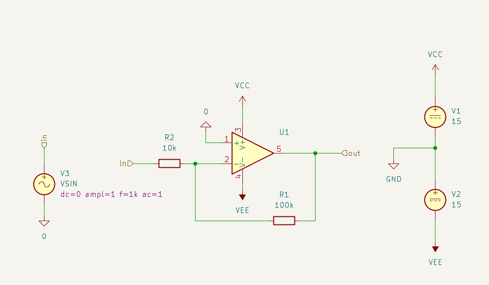

# Inverting Amplifier — KiCad + ngspice

An inverting op-amp amplifier designed in KiCad and simulated with ngspice, starting from a **generic behavioral op-amp model** and then replaced with a **real-world op-amp SPICE model (Texas Instruments OPA1641)** for comparison.

This project is part of a structured 90-day self-study roadmap in KiCad schematic design, SPICE simulation, and analog circuit fundamentals.

---

## 1. Circuit Description

**Topology:** Classic inverting amplifier

| Component | Value | Role |
|---|---|---|
| R2 | 10 kΩ | Input resistor |
| R1 | 100 kΩ | Feedback resistor |
| U1 | Generic op-amp / OPA1641 | Active device |
| V1, V2 | ±15 V | Split supply (VCC / VEE) |
| V3 | VSIN, dc=0, ampl=1 V, f=1 kHz, ac=1 | Input source |

**Closed-loop gain:**

```
Av = -R1 / R2 = -100k / 10k = -10  (≈ 20 dB, 180° phase inversion)
```

The non-inverting input (pin 1) is tied to ground (0 V reference), and the inverting input (pin 2) is the summing node between R2 and the R1 feedback path — the standard inverting amplifier configuration.



---

## 2. Simulations Performed

Three standard analyses were run to fully characterize the amplifier:

### 2.1 DC Analysis (Operating Point / DC Sweep)
Purpose: verify the DC operating point and check for input-referred offset behavior at the summing node.

`results/generic_opamp/DC_analysis.png`

- Input swept roughly ±90 mV
- Output follows the expected inverted, gain-of-10 relationship
- V(in) at the summing node stays close to 0 V (virtual ground behavior of the inverting input)

### 2.2 AC Analysis (Frequency Response)
Purpose: characterize gain and phase vs. frequency (Bode plot), and observe the closed-loop bandwidth.

`results/generic_opamp/AC_analysis.png`

- Flat gain of ≈20–21 dB in the passband, matching the calculated -R1/R2 gain
- Gain rolls off at high frequency due to the op-amp's finite open-loop bandwidth (set by the POLE parameter in the generic model, or the real gain-bandwidth product in OPA1641)
- Phase shifts from 180° (inverting, in-band) toward 90° as frequency approaches the closed-loop bandwidth limit

### 2.3 Transient Analysis
Purpose: observe how the amplifier tracks and updates the output in time, and check for any dynamic distortion (slew-rate limiting, clipping).

results/generic_opamp/TRANS_analysis.png 

- 1 kHz, 1 Vpk sine input → output is an inverted sine at ≈10 Vpk
- Output visibly saturates near ±10 V, since the theoretical gain-of-10 output would reach ±10 V, close to the supply rail headroom — a useful reminder that op-amp output swing is always bounded by the supply rails (and by ROUT / output stage limitations in the model)

---

## 3. Changing Generic Op-Amp Model Parameters

KiCad's built-in **generic op-amp symbol** exposes 4 SPICE behavioral parameters, editable from:

```
Double-click symbol → Simulation Model... → Parameters tab
```

| Parameter | Meaning |
|---|---|
| `POLE` | Single-pole open-loop frequency response (sets the -3 dB bandwidth / rolloff) |
| `GAIN` | Open-loop DC gain |
| `VOFF` | Input offset voltage |
| `ROUT` | Output resistance |

**Workflow used:**
1. Open the op-amp symbol properties → Simulation Model
2. Change the target parameter (e.g. `VOFF` to introduce a non-zero input offset voltage)
3. Save the schematic
4. Re-run the DC / AC / Transient simulations

**Results after changing `VOFF`:**

| Analysis | Before | After |
|---|---|---|
| DC | `results/generic_opamp/DC_analysis.png` | `results/generic_opamp/DC_analysis_after_change_offset_parameter.png` |
| AC | `results/generic_opamp/AC_analysis.png` | `results/generic_opamp/AC_analysis_after_change_offset_parameter.png` |
| Transient | `results/generic_opamp/TRANS_analysis.png` | `results/generic_opamp/TRANS_analysis_after_change_offset_parameter.png` |

**Observation:** Changing `VOFF` shifts the DC operating point / crossover of the input-output DC sweep (since an input offset voltage directly adds an error term at the summing node), while the AC gain/phase shape and the transient waveform shape remain essentially unchanged — confirming that `VOFF` is a **DC-only** parameter and does not affect the small-signal frequency response or large-signal transient gain.

---

## 4. Real-World Op-Amp: OPA1641

To move from an idealized behavioral model to a "real" device, the generic op-amp was replaced with the **Texas Instruments OPA1641** SPICE macro-model (Green-Williams-Lis architecture), provided in `spice_models/OPA164x.LIB`.

```spice
.SUBCKT OPA164x IN+ IN- VCC VEE OUT
```

The same three analyses were re-run using this subcircuit in place of the generic op-amp:

| Analysis | Generic Op-Amp | OPA1641 |
|---|---|---|
| DC | `results/generic_opamp/DC_analysis.png` | `results/opa1641_real_model/DC_OPA1641.png` |
| AC | `results/generic_opamp/AC_analysis.png` | `results/opa1641_real_model/AC_OPA1641.png` |
| Transient | `results/generic_opamp/TRANS_analysis.png` | `results/opa1641_real_model/TRANS_OPA1641.png` |

**Observations:**
- The closed-loop DC gain and the in-band AC gain (≈20 dB) match the generic model, as expected — both are set by the passive feedback network (R1/R2), not by the op-amp itself.
- The real OPA1641 model shows a small, non-zero input offset voltage on the DC sweep (its own device-level imperfection), unlike the ideal generic model with `VOFF=0`.
- The frequency response rolloff behavior reflects the OPA1641's actual gain-bandwidth product rather than an arbitrary `POLE` value — a closer approximation to real op-amp behavior, useful for predicting bandwidth limitations in a real design.
- The transient response still shows the output saturating near the ±10 V level for the same 1 Vpk input, confirming the amplifier is being driven near its output swing limit regardless of which op-amp model is used.

**Important note about subcircuits (from the simulator log):** `gnd` inside a `.SUBCKT` is *not* automatically tied to node `0`. The OPA1641 subcircuit's internal ground reference is only correct if its VCC/VEE/IN+/IN-/OUT pins are properly connected at the top level — always double-check the pin mapping order (`IN+ IN- VCC VEE OUT`) when instantiating the subcircuit in KiCad.

---

## 5. Repository Structure

```
inverting-amplifier-kicad-ngspice/
├── README.md
├── kicad_project/                     # KiCad schematic + project files
│   ├── Inverting_amplifier_with_generic_OpAmp.kicad_sch
│   ├── Inverting_amplifier_with_generic_OpAmp.kicad_pro
│   ├── Inverting_amplifier_with_generic_OpAmp.kicad_pcb
│   └── Inverting_amplifier_with_generic_OpAmp.kicad_prl
├── spice_models/
│   └── OPA164x.LIB                    # TI OPA1641/OPA1642 SPICE macro-model
├── docs/
│   └── circuit_schematic.png
└── results/
    ├── generic_opamp/
    │   ├── DC_analysis.png
    │   ├── AC_analysis.png
    │   ├── TRANS_analysis.png
    │   ├── DC_analysis_after_change_offset_parameter.png
    │   ├── AC_analysis_after_change_offset_parameter.png
    │   └── TRANS_analysis_after_change_offset_parameter.png
    └── opa1641_real_model/
        ├── DC_OPA1641.png
        ├── AC_OPA1641.png
        └── TRANS_OPA1641.png
```

---

## 6. Tools Used

- **KiCad** (schematic capture + ngspice integration)
- **ngspice** (DC / AC / Transient simulation engine)
- **OPA1641 SPICE model** — Texas Instruments

---

## 7. Key Takeaways

- Closed-loop gain of a well-designed inverting amplifier is set almost entirely by the passive feedback network (R1/R2), largely independent of the op-amp's internal open-loop parameters — as long as loop gain is high enough in the frequency band of interest.
- Generic behavioral models (POLE/GAIN/VOFF/ROUT) are a fast way to sanity-check a topology before committing to a specific real device.
- Swapping in a real op-amp's SPICE model (OPA1641) is the necessary next step to validate bandwidth, offset, and output-swing behavior against datasheet-accurate limits.
- Output swing is always bounded by the supply rails — a gain-of-10 stage with a 1 Vpk input and ±15 V rails will saturate before reaching the full theoretical 10 Vpk output headroom.

---

## Author

Karim Adel — Junior AMS Layout Engineer, exploring KiCad/SPICE as part of a structured analog & PCB design learning path.
